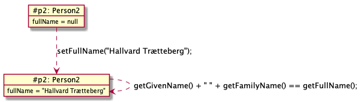

# Person

Dette eksemplet illustrerer innkapsling og hvordan det tillater ulike representasjoner.

## Innkapsling

Innkapsling har to formål:
1) Først og fremst skal det *hindre* at et objekt *brukes galt* og havner i en *tilstand som er ugyldig* og kan føre til feil (siden).
2) For det andre skal det gjøre det enklere å endre detaljer i (koden for) håndtering av intern tilstand, uten at koden i andre klasser også må endres.

Det er i hovedsak det andre punktet som illustreres her, men vi sørger også for noe validering.

Eksempelobjektet vårt holder rede på for- og etternavn. Tanken er å ha to ulike representasjoner, én hvor for- og etternavn lagres i hver sin variabel, og én hvor de lagres sammen i én variabel. I begge tilfelles støttes de samme metodene for både å lese og endre navnene. 

## Koden

### Lese- og endringsmetoder

I motsetning til i [Date-eksemplet](Date.md) så starter vi med å bestemme lese- og endringsmetodene. Det skal gå an å lese og endre for- og etternavn for seg, samt lese og endre det fulle navnet. Det fulle navnet er definert som for- og etternavn skilt med mellomrom, og hvis ett eller begge ikke er satt, så brukes "?" i stedet for delnavnet. Her er deklarasjonene:

```java
// leser fornavn
public String getGivenName() { ... }
// setter fornavm
public void setGivenName(String givenName) { ... }

// leser etternavn
public String getFamilyName() { ... }
// setter etternavn
public void setFamilyName(String familyName) { ... }

// leser fullt navn, som er for- og etternavn skilt med mellomrom
// bruker "?" hvis et delnavn ikke er satt
public String getFullName() { ... }
// setter fullt navn, argumentet forventes å ha samme format som det som returneres av getFullName
public void setFullName(String fullName) { ... }
```

### Valideringsmetoder

Uavhengig av hvordan navn representeres, så trenger vi metoder for å validere delnavn. Vi definerer at navn bare kan inneholde bokstaver, punktum og bindestrek. Et fornavn kan dessuten inneholde mellomrom:

```java
public boolean isValidName(String name, boolean allowBlank) {
   for (int i = 0; i < name.length(); i++) {
      char c = name.charAt(i);
      if (! (Character.isLetter(c) || (c == ' ' && allowBlank) || ".-".indexOf(c) >= 0)) {
         return false;
      }
   }
   return true;
}
	
private void checkName(String name, boolean allowBlank) {
   if (! isValidName(name, allowBlank)) {
      throw new IllegalArgumentException("Illegal character(s) in name: " + name);
   }
}
```

Vi har her valgt å deklarere **isValidName** som **public**, slik at andre klasser kan forhåndssjekke navn, noe som kan være nyttig for validering av teksten i innfyllingsfelt i en app. **checkName**-metoden er mindre nyttig i så måte, så den er deklarert som **private**.

### Variant 1: Variabler og metodeimplementasjoner

[Variant 1](Person1.java) bruker to variabler for tilstanden, én for fornavn og én for etternavn:

```java
private String givenName;
private String familyName;
```

Lese- og endringsmetodene for for- og etternavn blir trivielle, siden lesemetoden kan returnere variabelverdiene direkte, og endringsmetodene kan sette tilsvarende variabel, etter å ha validert argumentet:

```java
public String getGivenName() {
   return givenName;
}

public void setGivenName(String givenName) {
   checkName(givenName, true);
   this.givenName = givenName;
}
	
public String getFamilyName() {
   return familyName;
}

public void setFamilyName(String familyName) {
   checkName(familyName, false);
   this.familyName = familyName;
}
```

De siste to lese- og endringsmetodene blir litt mer kompliserte, siden de må henholdsvis sette sammen og splitte tekstverdier og ta høyde for tomme for- og etternavn:

```java
public String getFullName() {
   String gn = givenName;
   if (gn == null) {
      gn = "?";
   };
   String fn = familyName;
   if (fn == null) {
      fn = "?";
   };
   return gn + " " + fn;
   // kompakt variant:
   // return (givenName != null ? givenName : "?") + " " + (familyName != null ? familyName : "?") 
}

public void setFullName(String fullName) {
   checkName(fullName, true);
   int pos = fullName.lastIndexOf(' ');
   String gn = fullName.substring(0, pos);
   if (gn.equals("?")) {
      gn = null;
   }
   String fn = fullName.substring(pos + 1);
   if (fn.equals("?")) {
      fn = null;
   }
   this.givenName = gn;
   this.familyName = fn;
}
```

Her brukes **lastIndexOf**-metoden for å finne posisjonen til det *bakerste* mellomrommet, som skiller for- og etternavn, og **substring** brukes for å hente ut teksten foran eller bak. Merk også at **equals** brukes for å sjekke String-objekter bokstav for bokstav, siden **==** vil sjekke om det er de samme objekt(referans)ene, ikke at de inneholder de samme bokstavene!

### Variant 2: Variabler og metodeimplementasjoner

[Variant 2](Person2.java) bruker én variabel for tilstanden, som lagrer det fulle navnet:

```java
private String fullName;
```

I denne varianten er det lese- og endringsmetodene til det fulle navnet som blir trivielle:

```java
public String getFullName() {
   return fullName;
}

public void setFullName(String fullName) {
   checkName(fullName, true);
   this.fullName = fullName;
}
```

De to andre parene av lese- og endringsmetoder blir tilsvarende mer kompliserte:

```java
public String getGivenName() {
   int pos = fullName.lastIndexOf(' ');
   String gn = fullName.substring(0, pos);
   if (gn.equals("?")) {
      gn = null;
   }
   return gn;
}
	
public void setGivenName(String givenName) {
   checkName(givenName, true);
   if (givenName == null) {
      givenName = "?";
   }
   int pos = fullName.lastIndexOf(' ');
   fullName = givenName + " " + fullName.substring(pos + 1);
}
	
public String getFamilyName() {
   int pos = fullName.lastIndexOf(' ');
   String fn = fullName.substring(pos + 1);
   if (fn.equals("?")) {
      fn = null;
   }
   return fn;
}

public void setFamilyName(String familyName) {
   checkName(familyName, false);
   if (familyName == null) {
      familyName = "?";
   }
   int pos = fullName.lastIndexOf(' ');
   fullName = fullName.substring(0, pos) + " " + familyName;
}
```

### Testing med main-metoden

Det er alltid lurt å teste koden ved å opprette objekter, drive dem gjennom diverse tilstander og sjekke at lesemetodene gir forventet resultat. I **main**-metoden under så tester vi spesifikt (den forventede) sammenhengen mellom for- og etternavn og fullt navn. Siden forskjellen mellom Person1- og Person2-klassene er hvordan tilstand er representert og ikke oppførselen til **public**-metoder, så kan **main**-metodene faktisk være like! Selvsagt med unntak av hvilken klasse som instansieres.

```java
public static void main(String[] args) {
   Person2 p1 = new Person2();
   p1.setGivenName("Hallvard");
   p1.setFamilyName("Trætteberg");
   System.out.println(p1.getGivenName() + " " + p1.getFamilyName() + " == " + p1.getFullName());
   Person2 p2 = new Person2();
   p2.setFullName("Hallvard Trætteberg");
   System.out.println(p2.getGivenName() + " " + p2.getFamilyName() + " == " + p2.getFullName());
}
```

Her er objekttilstandsdiagram Person1-klassen:


... og for Person2-klassen:


