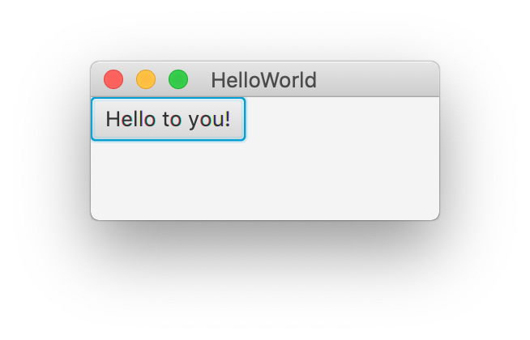

# Hello world med JavaFX og FXML

Dette er et minimalistisk eksempel på en JavaFX-app. Appen inneholder én knapp, og når den trykkes så endres teksten: 

 

Selv om app-en er liten, så er det nok til å illustrere de viktigste mekanismene ved bruk av FXML for å lage app-er.

## JavaFX og FXML

JavaFX er et såkalt *GUI-rammeverk*, som inneholder klasser og metoder for å lage grafiske brukergrensesnitt.
For å lage et brukergrensenitt, så rigger man en struktur av *GUI-objekter*. Dette kan være rent *grafiske* elementer, som streker, bokser, rammer, og bilder, og *interaktive* elementer, som knapper, innfyllingsfelt og lister. I tillegg skriver en kode som *trigges* av interaksjonen, og denne *responderer* ved å endre på *GUI-objektene.

For vår app er det to GUI-objekter som må rigges opp (utenom applikasjonsvinduet, som uansett trengs), et panel og knappen som er inni.

Strukturen av GUI-objekter kan rigges opp på tre ulike måter:
1. En kan skrive Java kode, typisk instansiering av GUI-elementene og kall til metoder som setter det sammen til en struktur.
2. En kan skrive FXML-kode som inneholder elementer (tags) tilsvarende GUI-elementene og strukturert som GUI-et. Denne lastes inn med Java-kode ifm. oppstart av app-en. En får da en objektstruktur tilsvarende 1, men med mindre arbeid.
3. En kan alternativt bruke SceneBuilder-appen, som lar deg redigere GUI-et grafisk, og lagre det vha. FXML, som så kan lastes inn som i 2.

Variant 1 og 2 ligner, fordi de begge bruker tekstlig kode som kan skrives i Eclipse, mens variant 2 og 3 ligner, fordi de begge gir FXML-kode som lastes inn med Java-kode. Her velger vi å forklare variant 2 grundigst, siden FXML er hendig for de fleste app-er og prinsippene bak FXML-koden uansett må forstås.

Selve reaksjonen på brukerinteraksjonen, f.eks. taste- og knappetrykk, klikk på knapper, valg i lister osv, kodes alltid i Java, selv om selve triggingen kodes i FXML (variant 2 og 3).

## Rigging av GUI med Java-kode

Når vi rigger GUI-et med Java-kode, får vi typisk en sekvens av instansieringer med **new** og kall til metoder som bygger en struktur:

```java
var panel = new HBox();
var button = new Button("Hello world!");
panel.getChildren().add(button);
```

Her lager vi et panel av typen **HBox** (horisontalt utlegg), en knapp av typen **Button** og putter knappen inn i panelet. Merk at vi bruker Java 10-syntaks, hvor **var** kan erstatte typen i deklarasjonen av lokale variabler, når java kan utlede typen basert på høyresiden av deklarasjonen.

## FXML
Med FXML så rigges GUI-et med HTML-aktig syntaks (som HTML så er FXML et XML-basert språk), som er mer lettlest og -skrevet enn tilsvarende Java-kode og har en hierarkisk struktur tilsvarende GUI-strukturen:

```fxml
<HBox>
	<Button text="Hello world!"/>
</HBox>
```

Dette er ikke all FXML-koden som trengs (see [koden](HelloWorld.fxml), men det vesentlige som tilsvarer Java-koden over. Enkelt sagt så tilsvarer **HBox**-elementet å utføre **new HBox()**, mens **Button**-elementet tilsvarer å først utføre **new Button()** og så kalle **setText("Hello world!")** på **Button**-objektet en da får.  

## SceneBuilder

Den samme FXML-koden kan 'skrives' (evt. redigeres) ved å bruke SceneBuilder, som er en grafisk applikasjon for å utforme GUI-et og som bruker FXML som lagringsformat. Det er veldig hendig, fordi det er lettere å se hvordan sluttresultatet blir.


## App-klassen

Selv om mye kan gjøres med FXML, så må app-en som helhet startes opp vha. en egen app-klasse, som bl.a. laster inn FXML-fila. Når en bruker FXML, så kan app-klassen være svært standardisert ved at det bare er små ting, først og fremst navnet på FXML-fila og evt. tittelen til app-vinduet, som endres fra gang til gang:

```java
public class HelloWorldApp extends Application {

   @Override
   public void start(final Stage primaryStage) throws Exception {
      primaryStage.setTitle("HelloWorld");
      primaryStage.setScene(new Scene(FXMLLoader.load(getClass().getResource("HelloWorld.fxml"))));
      primaryStage.show();
   }

   public static void main(final String[] args) {
      Application.launch(args);
   }
}
```

Når en skriver **extends Application** bak klassenavnet, så blir dette en app-klasse, og da kreves det at den har en **start**-metode med et **Stage**-parameter. For å kunne kjøre klasse som et Java-program, så trengs også en **main**-metode som sørger for opprettelse og oppstart av (en instans av) app-klassen vår.

**start**-metoden har som oppgave å konfigurere app-vinduet. Her settes først tittelen, og deretter lastes FXML-koden inn vha. FXMLLoader-klassen sin load-metode og settes som innholdet i app-vinduet. Til slutt gjøres app-vinduet synlig.

Denne koden kan gjenbrukes med små endringer i andre app-er, en trenger bare endre navnet til FXML-fila og evt. tittelen til app-vinduet. Merk at teknikken for å navngi FXML-fila baserer seg på at den ligger i samme pakke/mappe som app-klassen.

## Interaktivitet

App-koden som er vist over, vil laste inn FXML-koden, lage tilsvarende GUI-objekter (et HBox-objekt med et Button-objekt inni) og legge dem inn i app-vinduet. Når den så vises frem vil en se et vindu som på det venstre bildet over. App-en virker såpass at hvis en klikker på knappen, så vil den reagere som en knapp, men uten app-spesifikk logikk. For å gjøre app-en *interaktiv* så trengs det en såkalt *kontroller*-klasse og kode i FXML-fila som kobler dem sammen.

### Kontroller-klassen

Første trinn er å lage en (tom) kontroller-klasse og oppgi det fulle navnet til kontroller-klassen i det ytterste FXML-elementet:

```java
package javafx.helloworld;

public class HelloWorldController {
   ...
}
```

```fxml
<HBox fx:controller="javafx.helloworld.HelloWorldController">
   ...
</HBox>
```

Vi har her valgt å kalle kontroller-klassen **HelloWorldController**, og siden den ligger i pakken **javafx.helloworld**, så blir **package**-deklarasjonen og **fx:controller**-attributtet som over. Når FXML-koden nå lastes inn av app-klassen, så blir det automagisk (!) laget en instans av kontroller-klassen, tilsvarende å utføre **new HelloWorldController()**, i tillegg til **HBox**- og **Button**-objektene.

### Trigging av metoder og oppdatering av GUI-objekter

Neste trinn er å gjøre app-en interaktiv, ved å legge til mer kode i både kontroller-klassen og FXML-fila. Interaktivitet betyr her to ting:
1. Kode i kontrolleren må trigges når brukeren gjør noe med GUI-objektene
2. Som respons må kontrolleren endre på GUI-et

```java
@FXML
private Button helloWorldButton;

@FXML
private void handleHelloWorldButton() {
   helloWorldButton.setText("Hello to you!");
}
```

```fxml
<Button fx:id="helloWorldButton" text="Hello world!" onAction="#handleHelloWorldButton"/>
```

Punkt 1. håndteres av metoden **handleHelloWorldButton** og **onAction**-attributtet, som gjør at **handleHelloWorldButton**-metoden kalles når knappen trykkes på.
Punkt 2. håndteres av **helloWorldButton**-variablen og **fx:id**-attributtet, som gjør at **helloWorldButton**-variablen automagisk blir satt til å referere til det tilsvarende **Button**-objektet. Dermed kan (teksten i) knappen endres som respons på at den trykkes. Merk at det ikke spiller noen rolle hva metoden og variablen heter, så lenge navnene stemmer overens med hhv. **onAction**- og **fx:id**-attributtene i FXML-koden.

### FXML-annotasjoner

Foran både metode- og variabel-deklarasjonene er det en såkalt **@FXML**-annotasjon, som markerer at disse brukes på en bestemt måte av FXML-innlastingsautomagien. Uten **@FXML** foran variabel-deklarasjonen vil **handleHelloWorldButton**-metoden kræsje, fordi variablen ikke vil være satt til GUI-objektet med tilsvarende **fx:id**. Og uten **@FXML** foran metode-deklarasjonen vil FXML-innlastingskoden kræsje, fordi metoden navngitt i **onAction**-attributtet ikke finnes når GUI-objekter og kontroller kobles sammen.

Deklarasjon av variabler med **@FXML**-annotasjon foran og tilsvarende **fx:id**-attributter er en generell mekanisme som brukes når kontrolleren trenger en referanse til et bestemt GUI-objekt. Slik referanser brukes i responskode, som den over i **handleHelloWorldButton**-metoden.

### Initialisering

Noen ganger trengs ekstra initialisering av GUI-objekter uten over den en får gratis av FXML-koden. 
Da trenger en også slike referanser til GUI-objekter. F.eks. kunne vi satt den initielle teksten til knappen ved å legge til følgende kode:

```java
@FXML
private void initialize() {
   helloWorldButton.setText("Hello world!");
}
```

En slik **initialize**-metode, uten parametre og med **@FXML-annotasjon**, blir kalt automagisk **etter** at kontroller-instansen og GUI-objektene er laget og de spesielle GUI-objektreferansene er satt. Dermed kan koden referere til og endre relevante GUI-objekter i initialiseringsfasen av app-oppstarten.
Initialisering vha. kode er mest relevant for GUI-elementer som viser dynamiske data, f.eks. lest fra en fil eller database, eller når hvilke GUI-elementene en trenger bestemmes dynamisk. 
