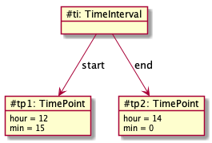
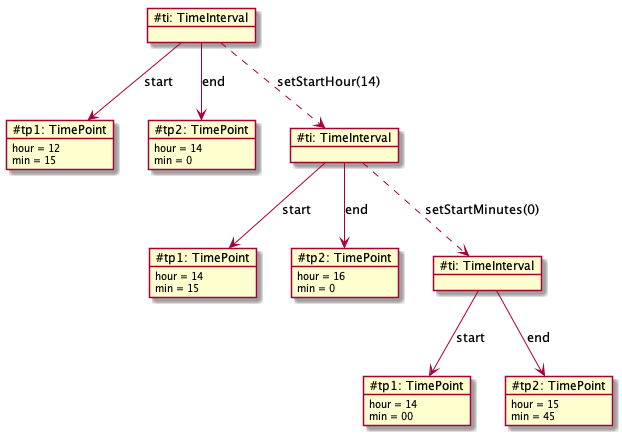

# Time interval

Dette eksemplet bygger på [encapsulation.TimeInterval](../../encapsulation/timeinterval/TimeInterval.md) og viser hvordan struktur av objekter fungerer for å representere et tidsintervall.

Vi skal her se på en fjerde (!) måte å representere tidsintervallet på, ved bruk av en hjelpeklasse for tidspunkt. I stedet for ett objekt for å representere et konkret tidsintervall så må en nå bruke tre. API-et, altså de offentlige metodene, skal være de samme.

## Koden

I denne varianten så representeres tidsintervallet med to variabler som refererer til to **TimePoint**-objekter:

```java
private TimePoint start;
private TimePoint end;
```

I praksis betyr dette at hele tilstanden for tidsintervallet er fordelt på tre objekter, to **TimePoint**-objekter holder på henholdsvis start- og slutt-tidspunktet og ett **TimeInterval**-objekt refererer til disse:



### Testing med main-metoden

```java
public TimeInterval(int startHour, int startMin, int endHour, int endMin) {
   checkInt(startHour, 0, 24);
   checkInt(startMin, 0, 60);
   checkInt(minutes(startHour, startMin, endHour, endMin), 0, 24 * 60);
   this.startHour = startHour;
   this.startMin = startMin;
   this.endHour = endHour;
   this.endMin = endMin;
}
```

