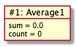
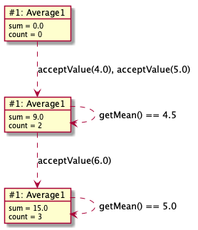

# Average1

Dette eksemplet er, sammen med [Average2](Average2.md), ment å utvide forståelsen av sammenhengen mellom hvilke metoder et objekt har og hvilken intern tilstand i form av variabler, det trenger.

## Objekt-utforming

Vi ønsker oss et objekt som kan holde rede på gjennomsnittet av en sekvens med desimaltall, som det mottar.
Objektet mottar altså (desimal)tall utenifra og skal kunne gi tilbake gjennomsnittet av tallene det hittil har mottatt.

Vi stiller oss de samme grunnleggende spørsmål, som i [Counter1](../counter/Counter1.md):
- **Hva må objektet huske (på av data) for å kunne oppføre seg riktig?** Formelen for gjennomsnitt er *sum / antall*, så det er nok å holde rede på en løpende sum og antall (desimal)tall som er mottatt.  
- **Hvilke data må oppgis når objektet opprettes/starter?** Ingen.
- **Hva må en kunne spørre objektet om?** Objektet må kunne gi oss gjennomsnittet av tallene det hittil har mottatt.
- **Hvilke operasjoner må en kunne utføre på dataene?** Objektet må kunne ta imot et nytt desimaltall.

## Koding

### Klassedeklarasjonen

Vi bruker **Average1** som klassenavn og legger java-fila i **stateandbehavior/average**-mappa under **src**:

```java
package stateandbehavior.average;

class Average1 {
   // først kommer variabel-deklarasjoner
   // så konstruktører
   // deretter metoder
}
```

### Variabeldeklarasjoner

Alt som objektet må huske må lagres i variabler,
så for at **Average1**-objektene skal kunne holde rede på en løpende sum og antallet mottatte tall, så trenger vi følgende variabeldeklarasjoner:

```java
double sum = 0.0;
int count = 0;
```

**double** angir at variablene vil ha verdier som er *desimaltall*, mens **int** brukes for *heltall*. Her fungerer deklarasjonen også som initialisering.
I dette tilfellet kunne vi faktisk utelatt initialiseringen (men selvsagt ikke deklarasjonen) fordi 0.0 og 0 er standardverdien til henholdsvis double og int,
slik at det går for det samme. Men generelt bør variabler som dette initialiseres, slik at ønsket startverdi gjøres eksplisitt.

### Konstruktør(er)

Siden det ikke kreves at en må oppgi noe ved opprettelsen av objekter, så trenger vi ingen (eksplisitt) konstruktør.
Hvis det ikke deklareres noen, så vil Java lage en uten parametre, slik at vi kan lage et nytt **Average1**-objekt med **new Average1()**.

### Objektdiagram

Opprettelse av et **Average1**-objekt med **new Average1()** gir følgende objekt(diagram):



### Metoder

```java
double getMean() {
   return sum / count;
}

void acceptValue(double value) {
   sum += value;
   // alternativ: sum = sum + value
   count++;
   // alternativ 1: count = count + 1
   // alternativ 2: count += 1
}
```

### Testing med main-metoden og objekttilstandsdiagram

```java
public static void main(String[] args) {
   Average1 average = new Average1();
   average.acceptValue(4.0);
   average.acceptValue(5.0);
   System.out.println("Gjennomsnitt: " + average.getMean());
   average.acceptValue(6.0);
   System.out.println("Gjennomsnitt: " + average.getMean());
}
```

Under ser du diagrammet som tilsvarer opprettelsen av **Average1**-objektet og sekvensen av kall i main-metoden.
 


Spørsmål til slutt: Hva skjer hvis vi spør om gjennomsnittet før vi har gitt inn noen tall?

# Videre lesning

I [Average2](Average2.md) utvider vi Average1 med beregning av medianverdi!
