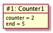
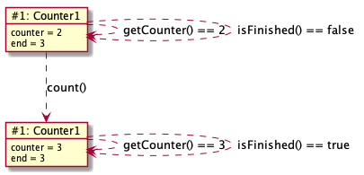

# Counter1

Dette eksemplet er ment å introdusere enkle objekter og klasser og tilhørende Java-syntaks.

## Objekt-utforming

Vi ønsker oss et objekt som holder rede på en heltallsteller, som skal løpe fra en startverdi til en sluttverdi.
Objektet skal la oss
- lese teller-verdien,
- øke verdien med 1 (hvis sluttverdien ikke er nådd) og
- sjekke om sluttverdien er nådd.

Når skal utforme (bestemme logikken til) objektet, må vi stille oss noen grunnleggende spørsmål:
- Hva må objektet huske (på av data) for å kunne oppføre seg riktig?
- Hvilke data må oppgis når objektet opprettes/starter?
- Hva må en kunne spørre objektet om?
- Hvilke operasjoner må en kunne utføre på dataene?

For vårt teller-objekt er en mulighet som følger:
- **Hva må objektet huske (på av data) for å kunne oppføre seg riktig?** Teller-objektet må vite hva teller-verdien (et heltall) og den øvre grensen (også et heltall) er.  
- **Hvilke data må oppgis når objektet opprettes/starter?** Når teller-objektet opprettes, så må en oppgi start-verdien og den øvre grensen.
- **Hva må en kunne spørre objektet om?** I beskrivelsen over står det at en må kunne lese teller-verdien og sjekke om sluttverdien er nådd.
- **Hvilke operasjoner må en kunne utføre på dataene?** Vi trenger kun én operasjon som endrer dataene, den som øker telleren med én. 

Når vi har tenkt gjennom dette, så kan vi begynne å kode!

## Koding

### Klassedeklarasjonen

Siden vi skal lage flere varianter av telleren vår, så bruker vi **Counter1** som navn på den første koden for telleren. Koden kalles en *klasse* og før vi fyller den med konkret logikk, så må vi skrive følgende:

```java
package stateandbehavior.counter;

class Counter1 {
   // først kommer variabel-deklarasjoner
   // så konstruktører
   // deretter metoder
}
```

**package**-setningen forteller at klassen hører til "mappa" **stateandbehavior.counter** (i den fysiske mappa **stateandbehavior/counter** i **src**-mappa i prosjektet).
Så følger klasse-deklarasjonen, som angir navnet til klassen og dermed også *typen* til teller-objektene. Det *full navnet* til klassen er **stateandbehavior.counter.Counter1**.

Klassenavnet må stemme med navnet til fila (med .java-endelse) og
bør begynne med stor forbokstav. Mellom krøll-parentesene kommer variabel- og metodedeklarasjoner (funksjoner).

### Variabeldeklarasjoner

Alt som objektet må huske må lagres i variabler,
så for at **Counter1**-objektene skal kunne holde rede på både teller- og sluttverdien, så trenger vi følgende variabeldeklarasjoner:

```java
int counter;
int end;
```

**int** angir at variablene vil ha verdier som er *heltall*. I motsetning til språk som Python og Javascript
så må typen til verdiene en variabel kan settes til, oppgis på forhånd. Dette kreves bl.a. for at vi skal kunne sjekke at variablene brukes riktig,
f.eks. tillater jo heltall bruk av både + og -, mens med tekst (**String**) så kan en bare bruke + (som da betyr "slå sammen").
Siden de to variablene har samme type, så kunne vi slått sammen de to linjene til **int counter, end;**, men
det regnes som god skikk å ha dem på hver sin linje.

### Konstruktør(er)

Siden vi krever at en må oppgi start- og sluttverdi for telleren på forhånd, så må vi lage en såkalt *konstruktør*, som brukes når objekter lages.
Det er vanlig å ha den rett etter variable-deklarasjonene, og iht. logikken vi ønsker så kan den se slik ut:

```java
Counter1(int start, int end) {
   this.counter = start;
   this.end = end;
}
```

En konstruktør må ha samme navn som klassen, og parametrene tilsvarer det som må oppgis når en lager et nytt object med **new**, f.eks. **new Counter1(2, 5)**.
Vi ser at også parametre trenger en eksplisitt type, som naturlig nok er **int** (heltall) de også.
**this.counter** betyr **counter**-variablen i *dette* objektet og brukes for å gjøre si at vi setter en variabel i objektet og ikke en lokal variabel i metoden.
I den første linja kunne **this.** vært utelatt, fordi det ikke finnes noen lokal **counter**-variabel, men i neste linje, altså **this.end = end** er det vesentlig å ha **this.**
for å kunne skille mellom variablen i objektet og den lokale variablen (parameteret) i metoden.
De to tilordningene sikrer altså at de to variablene i objektet får riktige verdier fra starten, og generelt så er hensikten med en konstruktør å sikre at objektet
har en gyldig tilstand før det tas (ordentlig) i bruk.

### Objektdiagram

Det er vanlig å illustrere hvordan konkrete objekter ser ut vha. et *objektdiagram*. Med variabler og konstruktør som over vil et tenkt objekt opprettet med **new Counter1(2, 5)** se ut som følger:



I headeren i objekt-boksen har vi en id (#1), som teknisk sett ikke er en del av objektet, men er en diagramteknisk måte å gjøre det enklere å referere til figuren. Ofte brukes et tall, men noen ganger et ord. Etter id-en følger det viktigste, nemlig navnet på klassen (Counter1). I hoveddelen av objekt-boksen har vi variablene, hvor både navn og konkret verdi er med. Siden verdiene kan endre seg i løpet av *levetiden* til objektet, så illustrerer diagrammet tilstanden til objektet på et bestemt *tidspunkt*. 

### Metoder

Etter konstruktøren er det vanlig å ha metoder for å lese ut/spørre om objektets innhold/tilstand, vi tar metoden for å lese ut telleren først:

```java
int getCounter() {
   return counter;
}
```

Typen til returverdien angis (som for variabler) foran navnet (som bør begynne med liten forbokstav), og så kommer parameterlista
(som i tilfellet her er tom, men likevel ikke kan utelates).
Når en metode som her, returnerer en enkel verdi, så er det standard å sette "get" foran det verdien representerer, som ofte også er navnet på variablen.
Konvensjonen i Java er å ha stor forbokstav i hvert *delord*, såkalt "camel case", istedet for å ha - eller _.
Her kunne vi brukt **this.** foran **counter** for å gjøre det eksplisitt at vi refererer til variablen i objektet,
men siden det her er nokså opplagt, det er jo ingen lokal variabler, så utelater vi det.

Metoden for å sjekke om telleren har nådd (eller passert) sluttverdien, kan skrives slik:

```java
boolean isFinished() {
   return counter >= end;
}
```

**boolean** angir som over, typen til returverdien, som her er en *logisk* verdier, altså enten **true** eller **false**.
At navnet begynner med "is" skyldes et unntak i regelen med "get" som prefiks: Når returtypen er **boolean** så brukes "is".
**return**-setningen kan virke litt rar, **counter >= end** er jo en betingelse, men det henger jo på greip
siden *verdien* av en sammenligning nettopp er en logisk verdi av typen **boolean**. En kunne skrevet

```java
if (counter >= end)
   return true;
else
   return false;
```

men det er mer tungvint å både lese og skrive i et tilfelle som dette.

Hvorfor bruke **>=** (større eller lik) og ikke **==** (lik)? Jo, i tilfelle objektet lages med en startverdi *høyere enn* sluttverdien,
så skal tellingen også regnes som ferdig!

Den siste metoden har som oppgave å øke telleren med 1, dersom tellingen ikke er ferdig allerede:

```java
void count() {
   if (! isFinished()) {
      counter = counter + 1;
      // alternativ 1: counter += 1
      // alternativ 2: counter++
   }
}
```

Her angir **void** at metoden *ikke* returnerer noen verdi (void = tomrom, altså manglende verdi), og derfor kan vi utelate **return**-setningen.
**isFinished()** er et kall til metoden vi skrev over, objektet spør på en måte seg selv om tellingen er ferdig, for det er jo bare om den ikke er det at den skal økes.
Det både gjøre koden mer leselig og unngår duplisering av kode, som generelt er en uting.
Kommentarene under setningen som øker counter-variablen viser alternative måter å skrive det på.

### Testing med main-metoden

Hva gjenstår nå? Jo, å prøve ut koden! Counter1-klassen er foreløpig ikke noe program som kan kjøres direkte, da den bare inneholder teller-logikk som kan brukes hvis en har et (eller flere) **Counter1**-objekt(er).
Slike objekter kan brukes i mange typer program eller app-er, og hvis vi kun ønsker å test koden, så er det enkleste å lage en såkalt **main**-metode.
En **main**-metode kreves for å kjøre klassen som et selvstendig program, og den må være deklarert på en helt spesifikk måte:

```java
public static void main(String[] args) {
   // her putter vi koden som tester Counter1-klassen
}
```

For å test koden vår, lager vi et **Counter1**-objekt og veksler mellom å lese innholdet med **getCounter**- og **isFinished**-metodene og skrive ut resultatet med **System.out.println**,
og å endre tilstanden til objektet ved å kalle **count**-metoden:

```java
public static void main(String[] args) {
   Counter1 counter = new Counter1(2, 3);
   System.out.println("Counter is: " + counter.getCounter());
   System.out.println("isFinished? " + counter.isFinished());
   counter.count();
   System.out.println("Counter is: " + counter.getCounter());
   System.out.println("isFinished? " + counter.isFinished());
}
```

Du kan selv tenke deg til hva som er forventet utskrift og så sjekke at så er tilfellet ved å kjøre koden!
I Eclipse gjøres det ved å høyre-klikke i fila og velge Run As > Java Application. Dersom Java Application ikke dukker opp som valg i undermenyen,
så betyr det enten at **main**-metoden mangler eller at den ikke er deklarert riktig.

### Objekttilstandsdiagram

I **main**-metoden over endrer (det samme) Counter1-objektet tilstand ved at count-metoden kalles etter opprettelsen **new Counter1(2, 3)**. For å illustrere den trinnvise endringen av (ett eller flere) objekter brukes et *objekttilstandsdiagram*. Diagrammet under illustrerer hvordan objektet som opprettes i main-metoden, går fra en tilstand til en annen når **count**-metoden kalles.   



De to objekt-boksene representerer *samme* objekt i to ulike tilstander. En ser det er samme objekt, fordi id-ene er like. De stiplede pilene illustrerer utførelse av kode, f.eks. metodekall som her, som *potensielt* endrer tilstanden. En stiplet pil som går tilbake til samme objekt-boks, viser at tilstanden *ikke* endres. Diagrammet viser at dette er tilfellet for kall til **getCounter** og **isFinished**. For disse kallene vises forresten også forventet returverdi, det er greit å vite når en tenker på diagrammet som en "fasit" for test-utskriften.
Når tilstanden endres, så går den stiplede pilen til objekt-boksen som representerer den nye tilstanden. Dette er tilfellet når count-metoden kalles når objektet er i den øverste tilstanden. Merk at siden **count**-metoden er deklarert som **void**, så gir det ikke mening å vise forventet returverdi, den har jo ingen!

Spørsmål til slutt: Hva skjer hvis count-metoden kalles i den nederste tilstanden? Hvordan ville det vært riktig å illustrere det i diagrammet?

# Videre lesning

I [Counter2](Counter2.md) utvider vi Counter1 med muligheten for å restarte tellingen!
