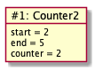
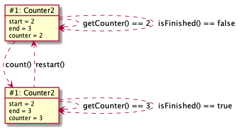

# Counter2

Dette eksemplet utvider [Counter1](Counter1.md) med mulighet for å restarte tellingen.

## Objekt-utforming

Som tidligere ønsker vi oss et objekt som holder rede på en heltallsteller, som skal løpe fra en startverdi til en sluttverdi.
Nå skal telleren altså kunne restartes (uavhengig av om den er ferdig eller ikke). Vi må stille oss de samme spørsmålene som tidligere:
- **Hva må objektet huske (på av data) for å kunne oppføre seg riktig?** I tillegg til teller-verdien og den øvre grensen, så må vi å også huske start-verdien!
- **Hvilke data må oppgis når objektet opprettes/starter?** Som tidligere, så må en oppgi start-verdien og den øvre grensen.
- **Hva må en kunne spørre objektet om?** Vi trenger ingen flere lese/spørre-metoder.
- **Hvilke operasjoner må en kunne utføre på dataene?** Vi trenger en ny endringsoperasjon for å restarte!

## Koding

Det enkleste er å kopiere koden fra tidligere, og så endre og legge til kode slik at logikken blir riktig.

### Klassedeklarasjonen

Siden klassenavnet nå er **Counter2** (og det *full navnet* til klassen er **stateandbehavior.counter.Counter2**), så må klasse-deklarasjonen endres:

```java
package stateandbehavior.counter;

class Counter2 {
	// resten er mye som før
}
```

Dette går av seg selv hvis du bruker kopier og lim-funksjonen av Counter1.java-fila i Eclipse.

### Variabeldeklarasjoner

Vi må legge til en **start**-variabel, siden vi jo må huske den opprinnelige start-verdien:

```java
// ny
int start;
// som før
int end;
int counter;
```

### Konstruktør(er) og metoder

Da må konstruktøren endres og metoden for å restarte legges til:

```java
// noe endret
Counter2(int start, int end) {
	this.start = start;
	this.end = end;
	restart();
}

// ny
void restart() {
	counter = start;
}
```

Her har vi valgt å kalle **restart**-metoden i konstruktøren, siden det som gjenstår etter initialisering av **start**- og **end**-variablene nødvendigvis tilsvarer å (re)starte telleren. 

### Objektdiagram

Objektdiagrammet for et objekt opprettet med **new Counter2(2, 5)** vil det ut som dette:



### main-metode og objekttilstandsdiagram

En mulig main-metode for å teste Counter2-klassen er vist under.

```java
public static void main(String[] args) {
   Counter2 counter = new Counter2(2, 3);
   System.out.println("Counter is: " + counter.getCounter());
   System.out.println("isFinished? " + counter.isFinished());
   counter.count();
   System.out.println("Counter is: " + counter.getCounter());
   System.out.println("isFinished? " + counter.isFinished());
   counter.restart();
   System.out.println("Counter is: " + counter.getCounter());
   System.out.println("isFinished? " + counter.isFinished());
   counter.count();
   System.out.println("Counter is: " + counter.getCounter());
   System.out.println("isFinished? " + counter.isFinished());
}
```

Endringene i tilstand kan illustreres med følgende objekttilstandsdiagram:



Merk hvordan kallet til restart leder tilbake til den første tilstanden. Det er jo hele hensikten med restart-metoden, å sette tilstanden tilbake til slik den var i starten!

## Alternativ utforming og kode

Dette skal virke, men kunne det vært gjort på en annen måte? En variant er å la counter-variablen løpe fra 0 og oppover. Da må følgende metoder endres:

```java
int getCounter() {
	return start + counter;
}

boolean isFinished() {
	return getCounter() >= end;
}

void restart() {
	counter = 0;
}
```

Merk hvor **isFinished** før brukte **counter**-variablen direkte, så går vi nå over til å kalle **getCounter**. Da er vi sikker å at vi sammenligner riktig verdi med **end**, uavhengig hvordan **getCounter** beregner returverdien.

Objektdiagrammet vil se slik ut, med denne alternative utformingen:


Du kan selv prøve å tegne objekttilstandsdiagram tilsvarende det over, men som stemmer med den nye utformingen. Hint: Siden det jo er meningen at de to alternative utformingene skal gi samme logiske oppførsel, så vil *strukturen* til diagrammet være som før.

De to variantene er like gode, så det er ikke noe poeng i seg selv å endre koden på denne måten, men det illustrerer to viktige poeng:
1. Kode som bare bruker **Counter2**-objektene sine metoder, vil ikke merke endringen! Vi kan si at endringene kun er interne for **Counter2**-klassen.
2. Hvis vi kaller metoder inni klassen, slik konstruktøren kaller restart og isFinished kaller getCounter, heller enn å bruke variabler direkte, så vil endring av logikken kreve færre endringer totalt sett.

Disse to poengene har med *abstraksjon* og *innkapsling* å gjøre, to veldig viktige begreper innen objektorientert programmering!
